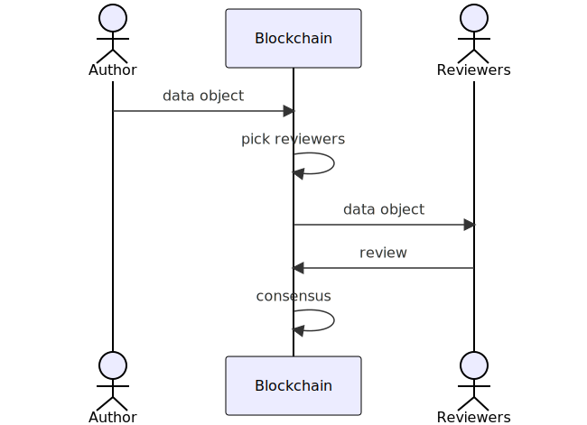

# GoodPrompt: transparent, decentralized, peer-reviewed data submission

# UI
1. author view:

    1. manual: enter  context,instruction,response,source
    1. LLM parsing: drop in a file (discord or emails) and LLM figures out the list of data points {context,instruction,response,source}
    1. dashboard that shows data, income and progress

2. reviewer view
    1. data object card:
        1. displays the data object {context,instruction,response,source}
        1. button accept (swipe right)
        1. button reject (swipe left)
        1. feedback (expands into a text field for feedback)
        1. refer to an expert button (expands into a field that takes the address or username of the expert, maybe suggestion list)
        1. skip
    1. status info such as rating, stats
    1. dashboard could be a tab or expand from status showing earnings, rating and so on

3. dataset explorer view
    1. search for datasets using graph protocol for a graph by description and tags
    1. show a table of teaching data objects. dispute button next to an object that expands into a feedback field
